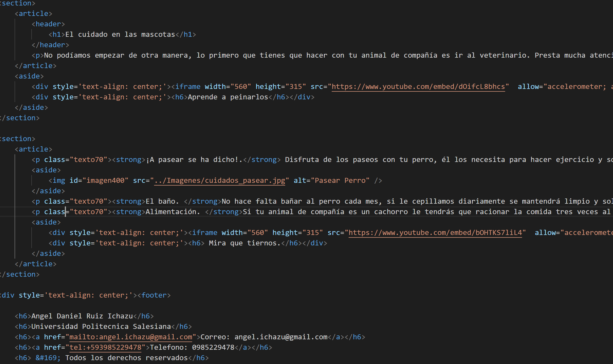

# Practica02-Mi-Sitio-Web-Css-
<strong>•	Paginas CSS</strong> 
 Primero que todo hay que general 3 hojas de estilo (.css), una para un formato de 3 columnas, otras para 2 columna y la última donde se encontrara el estilo general de la página como se mostrara en las siguientes imágenes:
 
Este es la página de estilo de 2 columnas. 
 
Esta es la página de estilo de 3 columnas. 
 
Esta es la página de estilo general, como se puede observar se utilizó diferentes reglas, como clases, etiquetas, descendente y pseudo-clases, además se modificó todo tipo de etiqueta. 
 
Acá se puede observar cómo se hicieron las pseudo clases 
 
En la siguiente imagen se observa cómo se creó la página html de contacto 
<strong>•	Aplicación de CSS en HTML</strong> 
Se deben aplicar los id y clases en las etiquetas html para que surjan efecto como se puede observar en la siguiente imagen: 
 
<strong>•	Validación de páginas HTML</strong> 
 
 
 
 
 
 
 
<strong>•	Validación de paginas CSS</strong> 
 
 
 
<strong>•	Conclusiones</strong> 
-Las páginas de estilos, ayudan a una navegación más agradable al usuario porque nos permiten un diseño uniforme y agradable 
-No se pueden utilizar ID para diferentes etiquetas, te dará un error a la hora de validarlo, lo mejor es usar Clases 
-Es bueno utilizar una paleta de colores y no ir poniendo colores al azar, eso ayuda a la hora de diseñar 

<strong>•	Link de GitHUB.</strong> 
Usuario: Facquer 
Link: https://github.com/facquer/Practica02-Mi-Sitio-Web-Css-  
<strong>Docente:</strong>  Ing. Gabriel León Paredes, PhD.  
<strong>Firma:</strong>  
<strong>Estudiante: </strong>Angel Daniel Ruiz Ichazu 
<strong>Firma:</strong> 

